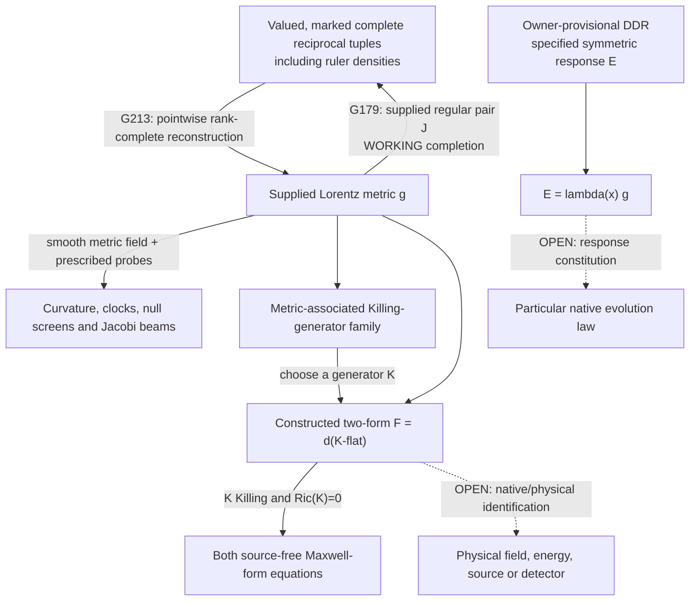

# NFCA1 — existing connections and the added field

This diagram summarizes the source-owned argument; it does not prove new
admissibility, population, dynamics or physical identification. Every path
retains its stated data and smoothness/regularity assumptions.

NR2 extends the aligned two-form survivor beyond the Killing construction on
its special supplied Brinkmann geometry. That does not create an arrow from
the scalar kernel to a selected field. Conversely, the upper metric/record
loop is an already-established conditional information bridge. It requires
complete typed data; one scalar, omitted densities or an unmarked network does
not supply the same information. Differential outputs require a suitable smooth
metric field, not one event's finite data alone.

The DDR E is symmetric; the field F is antisymmetric. No arrow identifies them.
G351/G352 contribute separate adopted-provisional conservation and chosen phase/
product readout under their own premises. No arrow equates those measures or
readouts with F. Those absent arrows represent unproved joins in the examined
sources, not impossibility theorems or a demand for new physical postulates.
